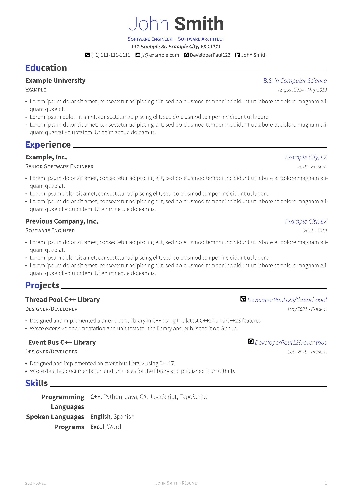
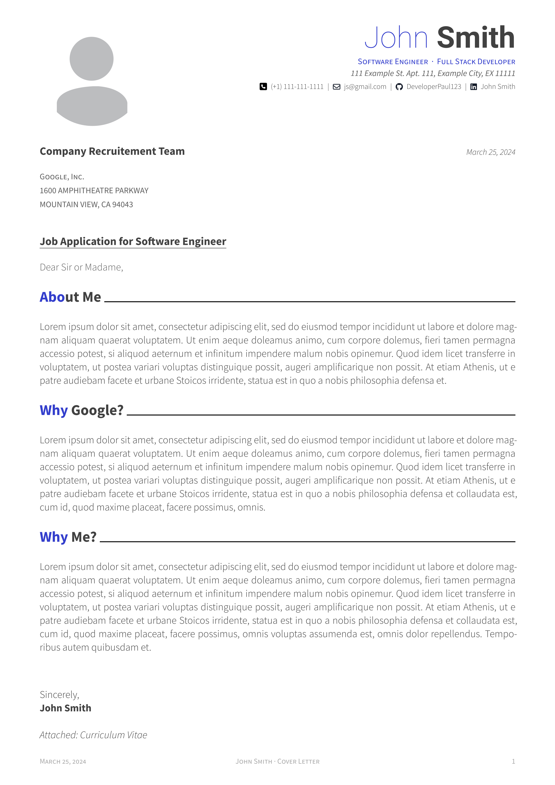

# Modern CV

[](https://github.com/DeveloperPaul123/modern-cv/stargazers)
[](https://discord.gg/CX2ybByRnt)


A port of the [Awesome-CV](https://github.com/posquit0/Awesome-CV) Latex resume template in [typst](https://github.com/typst/typst).

## Requirements

You will need the `Robot` and `Source Sans Pro` fonts installed on your system or available somewhere. You can download them from the following links:

- [Roboto](https://fonts.google.com/specimen/Roboto)
- [Source Sans Pro](https://github.com/adobe-fonts/source-sans-pro)

This template also uses FontAwesome icons via the `[fontawesome](https://typst.app/universe/package/fontawesome)` package.

See `typst fonts --help` for more information on configuring fonts for `typst` that are not installed on your system.

### Usage

Below is a basic example for a simple resume:

```typst
#import "@preview/modern-cv:0.1.0": *

#show: resume.with(
  author: (
      firstname: "John", 
      lastname: "Smith",
      email: "js@example.com", 
      phone: "(+1) 111-111-1111",
      github: "DeveloperPaul123",
      linkedin: "Example",
      address: "111 Example St. Example City, EX 11111",
      positions: (
        "Software Engineer",
        "Software Architect"
      )
  ),
  date: datetime.today().display()
)

= Education

#resume_entry(
  title: "Example University",
  location: "B.S. in Computer Science",
  date: "August 2014 - May 2019",
  description: "Example"
)

#resume_item[
  - #lorem(20)
  - #lorem(15)
  - #lorem(25)  
]
```

### Output

| | |
| --- | --- |
|  |  |